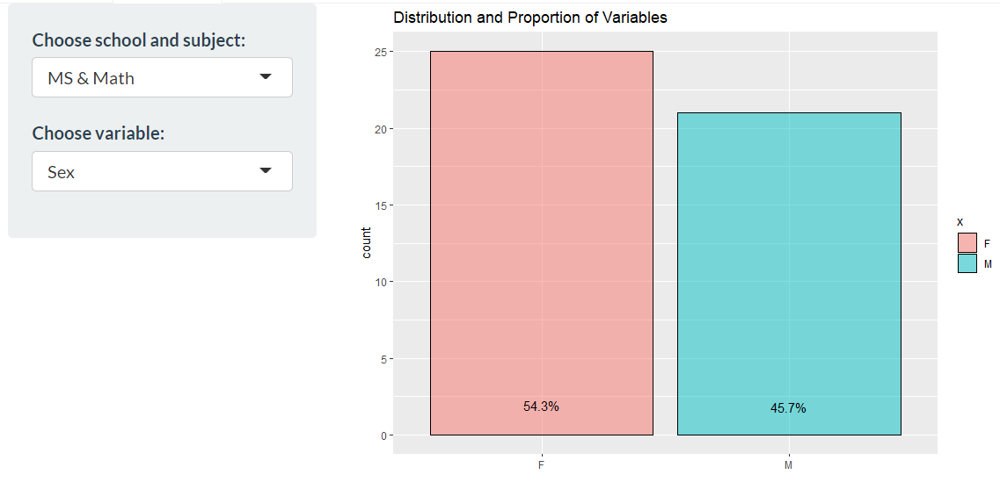

# Introduction 
In the past many years, there has been an emphasis on education around the world because of the impact it has on a person, be it in terms of employment opportunities and quality of life. It is hence important to know what are factors that affect one’s academic performance. While there are many factors that can impact a person’s academic performance, family background and one’s lifestyle are two of the larger factors.

Since there are many sub-factors in family background and lifestyle choices, the motivation of this study is to look deeper at these sub-factors to see which are the factors that have a greater correlation in the impact on a student’s grades. More specifically, this study aims to study the correlation between each factor and a student’s grades, as well as aiming to build a model that can accurately determine the academic performance of a student. From the findings, targeted help may be administered to students in these specific areas attributing to poor grades in school, therein helping them have a higher chance of a better future.

# Motivation and Objectives
Despite similar studies on the impact of lifestyle and family demographics on grades being done in past works, there is a general lack firstly a visualization of the data set where the data is mostly discussed through words and numbers. 

Our work was hence motivated by the absence of data visualization and interactivity of variables identified for analysis in the impact it has on student grades. This would be important in allowing users to explore the data to gain insights on it. To fill this gap, our goal is to create an application that allows users to be able to not just see the final results of which variable has the highest impact on grades, but to allow the exploration of the data set in an interactive way, to have a better sense of the data set, as well as to compare the impact between each variable.

The application will include the following features in order to fulfill the above objectives:

1) To provide data exploration through bar charts and histograms to study the distributions and proportions of each variable 

2) To provide clustering analysis of the data points to see which students are similar in terms of the surveyed variables

3) To perform predict analysis to identify which variables or a combination of variables have a significant impact on a student's academic performance

4) To provide interactive functions to perform data exploration

# Literature Review

Through performing a literature review, we found various studies that explore how one's lifestyle affects a student's academic performance. However, as lifestyle being such a generic term, many variables can be considered lifestyle. As such, majority of these studies focus on physical activity and eating habits which are not variables in our study. 

However, from these papers went through, it was observed that these either only provided tabular data on the data set, or basic charts for data visualization. Most studies also do not provide much exploration of the data set. For example in a study by Li and Qiu (2018), the focus was largely on finding out what impacts a student's academic performance, but provided only an overview of the data set used. No data visualization or any interactivity was available for users to have a closer look at the data. 

# Design Framework

The application will allow users to review three main types of analysis - exploratory and confirmatory data analysis, clustering analysis and predictive modeling. These being the main analysis types will be split by a separate tab in the application. Within each of these analysis types will involve different charts, which will include some functions of interactivity to allow the user to explore the data further. Within each tab, a tab "Usage" will be present to guide users on how to navigate around the selections. 

In designing the individual charts, we first look at the analysis to be performed, then choose the appropriate chart type for visualization. 

In exploratory data analysis, three charts will be utilized. Firstly, for the purpose of reviewing the distribution and proportions of each variable, a bar chart was used where the percentage proportions were included in the charts for clarity in cases where the proportions are similar. Secondly, to compare inputs between each variable against the average grade, the violin chart was used, with an overlay of the box plot. Third, a correlation plot was utilized to show the correlation amongst the variables, including the target variable, average grade. With many variables, an interactive correlation plot was created to allow the user to view specific correlation scores. This is because with the many variables in the data set, putting in numbers into each cell might cause the chart to become messy. In each of these three charts, the user is able to decide the data set and the variable to be explored.

For the clustering analysis, latent class clustering was used and presented through a series of stacked bar charts. Each variable will present a bar chart for each cluster, stacked by the factor levels for each of the variables. From here, the user is able to quickly compare the bar charts for each variable, and for variables that have very differing stacked bar charts between the clusters, it means the variable is a significant differing variable between the clusters. 

Finally for the predictive model analysis, the decision tree modeling will be used. Here, three charts will be presented - the decision tree diagram, a bar chart to show the level of importance of the variables, and a confusion matrix. The decision tree will the decision making process based on the inputs of each variable to reach the conclusion of the grades. However, knowing this flow may not be enough. Hence, a bar chart to show the importance of each variable was included, to rank the variables according to the impact it has on a student's grades. Besides this, it is also important to evaluate the performance of the model. Hence, the confusion matrix was included to allow the user to review the accuracy of the prediction of the grades. Here, the user is able to firstly select the data set, the number of bins for the grades, as well as the variables to be studied further. 

The demonstration of using each chart will be discussed further below. 

# Data Preparation

The data set used in this study was taken from [Kaggle](https://www.kaggle.com/uciml/student-alcohol-consumption), which contains two csv files, student-mat.csv and student-por.csv. The data was obtained from a survey of Portuguese students aged 15 to 22 from two schools on family demographics, lifestyle factors, along with their grades in mathematics and Portuguese language. The data set contains other variables that can be broadly classified into family demographics and lifestyle factors. 

Below are the variables included in the data set:

- Student's school
- Student's sex
- Student's age
- Student's home address type
- Family size
- Parent's cohabitation status
- Mother's education
- Father's education
- Mother's job
- Father's job
- Reason in choosing this school
- Student's guardian
- Home to school travel time
- Weekly study time
- Number of past class failures
- Extra education support
- Family educational support
- Extra paid classes within course subject
- Extra-curricular activities
- Attended nursery school
- Wants to take higher education
- Internet access at home
- In a romantic relationship
- Quality of family relationships
- Free time after school
- Going out with friends
- Workday alchohol consumption
- Weekend alcohol consumption
- Current health status
- Number of school absences
- First period grade
- Second period grade
- Final grade

Further data cleaning and manipulation was done, such as creating dummy variables for non-binary categorical variables, as well as having a new variable average grade, which will be used as the target variable. The data set was also split into four smaller data sets based on school and subject taken. This is reduce any variability due to the school the the student attends or the subject the student takes. Part of the interactivity will include the selection of the data set, to allow the user to explore the data sets of each combination of school and subject. 

# The Application

## Exploratory Data Analysis

### Distribution and Proportions

The bar chart and histogram will be used for users to see the distribution of proportions within each variable. This gives a clear breakdown and proportion of the inputs in each variable. Nominal data variables will utilize this bar chart, where the percentage proportion will be indicated so that comparisons can be done not out of estimation, but with clear data. Here, the user is able to firstly select the data set of interest, then the variable to review can be selected next. 

```{r echo=FALSE, message=FALSE, warning=FALSE, out.width='90%', fig.align='center', fig.cap='Bar Chart', fig.pos = 'h'}

```

As for the histogram, it will be used for the variables with a larger range. Due to larger range, the user is able to change the number of bins on top of selecting the data set and the variable. The histogram will also be interactive in a way where the user is able to hover the cursor over the data point to see the count.

```{r echo=FALSE, message=FALSE, warning=FALSE, out.width='90%', fig.align='center', fig.cap='Histogram', fig.pos = 'h'}
knitr::include_graphics("histo.png")
```

### Comparison of Results

The violin chart is the chart the user is able to use for comparing the difference between each variable with respect to the average grade. From the chart, besides having the boxplot where the user is able to see the indication of upper quartiles, lower quartiles and mean, the user is able to see the distribution of grades through the width of the violin graph. 

The user is able to select the data set to review as well as the specific variable to compare the distribution of grades across the inputs in each variable. 
 
\
\
\
\
\


```{r echo=FALSE, message=FALSE, warning=FALSE, out.width='90%', fig.align='center', fig.cap='Violin chart', fig.pos = 'h'}
knitr::include_graphics("violin.png")
```

### Correlation

For reviewing the correlation, the user is able to see a chart with interactivity functions. By itself, the user can see the correlation between each variable, as well as each variable with the average score, which is found on the top of the Y axis. Here, the correlation is indicated by colour, with blue representing a positive correlation and red indicating negative correlation. The intensity of the colour shows the degree of correlation. 

The user can hover the cursor over each box, where a tool tip will appear, indicating the two participating variables as well as the correlation value. This allows the user to see specific correlation values between variables. Similar to the static correlation chart, the correlation value is indicated by the colour and gradient. To have a closer look, the user is also able to drag a rectangle in the area of interest. 

```{r echo=FALSE, message=FALSE, warning=FALSE, out.width='90%', fig.align='center', fig.cap='Correlation chart', fig.pos = 'h'}
knitr::include_graphics("correlation.png")
```

## Cluster Analysis

### Latent Class Cluster Analysis

In cluster analysis, the aim is to group all the data points into smaller groups based on their traits, which are given by the individual inputs for each variable. From here, the user is able to explore and see which students are similar in terms of their demographics. In this section, latent class clustering was implemented with two clusters generated. In this chart, for each variable, there are two stacked bar charts, one for each cluster or group. 

By comparing the two bar charts across the variables, the user is able to pick out the variables were the stacked bar charts are different in terms of the factor levels. These will be the distinct traits for each of the clusters. 

```{r echo=FALSE, message=FALSE, warning=FALSE, out.width='90%', fig.align='center', fig.cap='Latent Class Clustering', fig.pos = 'h'}
knitr::include_graphics("latentclass.png")
```

\

## Predictive Modeling

For predictive modeling, the decision tree method was used. Three charts will be shown here - the decision tree, a bar chart based on the level of importance for each variable selected, and finally a confusion matrix. Here, the user is first able to select the number of bins to be created for the grades obtained by the students. Then, the user can select the variables to be studied further. The decision tree will automatically update and show how each variable represented by the circles and the logic indicated on the lines, and finally the grade bin shown by a box. 

```{r echo=FALSE, message=FALSE, warning=FALSE, out.width='90%', fig.align='center', fig.cap='Decision Tree', fig.pos = 'h'}

```

Below the decision tree is a simple bar chart to show the importance of each of the variables selected, sorted by descending order. Here, the user is able to immediate know which variable impacts grades the most out of the variables selected. 

```{r echo=FALSE, message=FALSE, warning=FALSE, out.width='90%', fig.align='center', fig.cap='Importance Bar Chart', fig.pos = 'h'}

```

Finally, a confusion matrix is presented, with the X-axis being the actual grade bins, and the Y-axis being the the predicted grade bin. This chart shows the user how well the model is able to predict the grade bin with the selected variables. 

```{r echo=FALSE, message=FALSE, warning=FALSE, out.width='90%', fig.align='center', fig.cap='Confusion Matrix', fig.pos = 'h'}

```


# Findings

Through various combinations of variable selection, we found that the top 5 variables that are important in predicting a student's grades are number of failures, number of absences, extra education support, weekend alcohol consumption as well as the desire for higher education.

```{r echo=FALSE, message=FALSE, warning=FALSE, out.width='90%', fig.align='center', fig.cap='Findings', fig.pos = 'h'}

```

With number of failures, it will definitely be a good predictor since it will show the competency level of the student in being able to do well. Absences may show the attitude the student has on studying, or if there are legitimate reasons for being absent, missing out on class would have an impact on the student's learning. Extra education support would make sense to be a significant variable since additional help would give these student an edge over the rest. With the desire for taking higher education comes a greater motivation to study and do well so that they are able to take on the next level of education. 

For alcohol consumption, studies have been done to show how these factors do affect one's academic performance to a certain extent. For example, in a paper by Mills et al. (2013) showing the impact of alcohol consumption on academic performance respectively. 

However, based on the results from the confusion matrix, the accuracy of prediction was not ideal. While the algorithm was able to pick up students who would score better, the model was not able to accuracy pick out students who fared badly.  

# Conclusion and Future Work

Being able to demonstrate the data visualization and implementation of interactivity within the application allows users to further explore data sets in a deeper way. Beyond just knowing what impacts a student's grades, the user is able to explore the demographics of the students as well as to study certain groups of students. 

Although our application was able to pick out some of the more significant variables, the results are not as ideal as we wanted as the level of accuracy is still not optimal. Hence, further work could be done to firstly implement and compare other methods of analysis and modeling. Secondly, to have a larger data set to obtain more accurate results as the results could be due to a small number of students who fared very well or very badly. 

Implementing another function where users can input their own data sets would be useful, to allow this application to be applicable to any user who has a data set that they would like to explore and perform analysis on. 

**Acknowledgements:**

The authors would like to thank Prof. Kam Tin Seong for his guidance and support in the completion of this project. 

# References

---
references:
- id: Li1
  title: How does family background affect children’s educational achievement? Evidence from Contemporary China
  author:
  - family: Li
    given: Zhonglu
  - family: Qiu
    given: Zeqi
  container-title: The Journal of Chinese Sociology
  URL: 'https://doi.org/10.1186/s40711-018-0083-8'
  DOI: 10.1038/nmat3283
  type: article-journal
  issued:
    year: 2018
    month: 10
    
- id: Ansari1
  title: Is alcohol consumption associated with poor academic achievement in university students?
  author:
  - family: Mills
    given: Claire
  - family: Qiu
    given: Zeqi
  - family: Stock
    given: Christiane
  - family: Ansari
    given: Walid El
  container-title: Int. J. Prev. Med
  URL: 'https://www.ncbi.nlm.nih.gov/pmc/articles/PMC3843305/'
  type: article-journal
  issued:
    year: 2013
    month: 10
...


