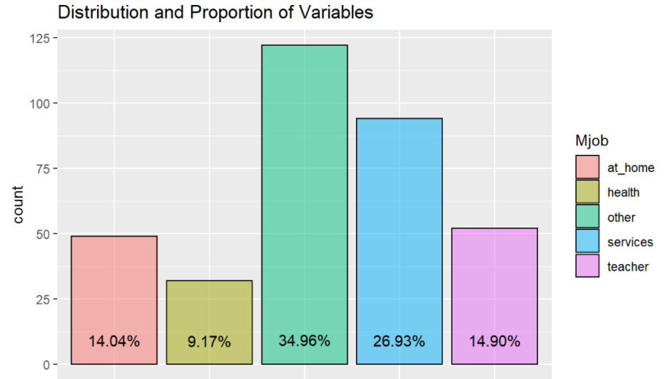

```{r setup, include=FALSE}
knitr::opts_chunk$set(echo = FALSE)
```

# Introduction
Education has a significant impact on a person, be it in terms of employment opportunities and quality of life. It is hence important to know what are factors that affect one’s academic performance. While there are many factors that can impact a person’s academic performance, family background and one’s lifestyle are two of the larger factors. While there are studies on the correlation between lifestyle and grades, data visualization and interactivity are mostly left out from these studies. 

# Objective/Motivation

Our project sets out to firstly provide an interactive data visualization application that provides data visualization and interactivity where users are able to explore the data in a deeper way, rather than to only see the final result. Secondly, utilizing this application, we aim to identify which variables in a data set impacts grades. 

# Approach/Methodology

Using R, we first performed data wrangling to import the raw data into R. Then, categorical data were transformed into multiple dummy binary data, while data type for ordinal data were set as ordinal. We also split the data by school and subject, to remove the variability in grades due to these variables.

Exploratory analysis was performed to explore the data set in terms of proportions within each variable. Then, clustering analysis was done to group students similar in terms of their demographics. Subsequently these clusters were compared against each other within individual variables to study the differences between these groups. 

Finally, predictive analysis was performed to identify variables that have significant impact to a student's grades.

# Exploratory Data Analysis
**Bar Chart/Histogram:** The bar chart and histogram chart is used to visualize the distribution and proportions of each variable in the data set, where the user is able to select the data set as well as the variable to explore.
```{r echo=FALSE, message=FALSE, warning=FALSE, out.width='80%', fig.align='center', fig.cap='Great figure!'}

```

**Violin Chart:** The violin chart overlayed with a boxplot provides the user with the distribution and the mean grades for each of the inputs in each variable selected. The chart also provides comparisons between the inputs, where if there is a significant difference in grades, the p-value will be shown. 
```{r echo=FALSE, message=FALSE, warning=FALSE, out.width='80%', fig.align='center', fig.cap='Great figure!'}

```

**Correlation Chart:** The correlation plot gives the user an overview of the correlations between each variable, including the average grade where positive and negative correlation are indicated by blue and red respectively. Here, the user can select a static plot or an interactive plot, where the user is able view the correlation value by hovering the cursor over the specific cell. 
```{r echo=FALSE, message=FALSE, warning=FALSE, out.width='80%', fig.align='center', fig.cap='Great figure!'}

```

# Cluster Analysis

In cluster analysis, the aim is to group all the data points into smaller groups based on their traits, which are given by the individual inputs for each variable. 

# Predictive Modeling

# Findings

# Future Work

- Including a function to compare distributions or proportions between variables could be added to further explore the different variables in the data set

- Exploring more methods of analysis, for example latent class analysis for clustering analysis will be useful in comparing results from different methods

- 


```{r, include=FALSE}
knitr::write_bib(c('knitr','rmarkdown','posterdown','pagedown'), 'packages.bib')
```

