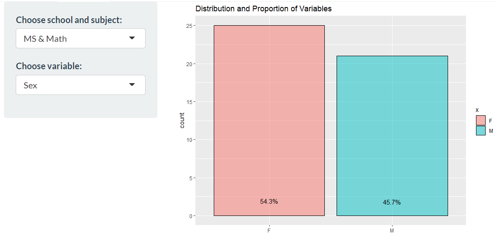
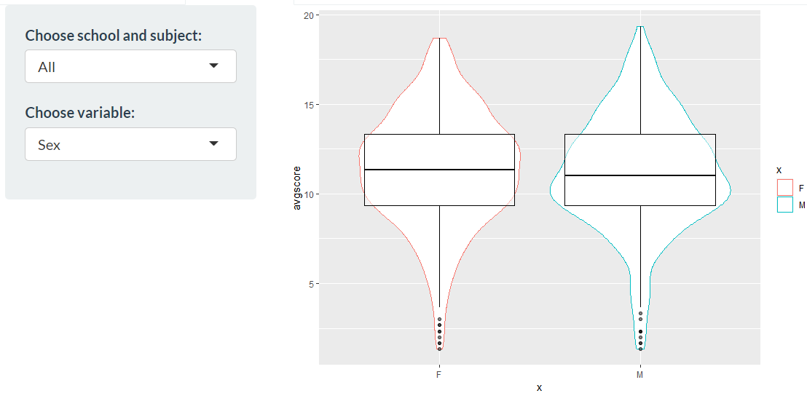
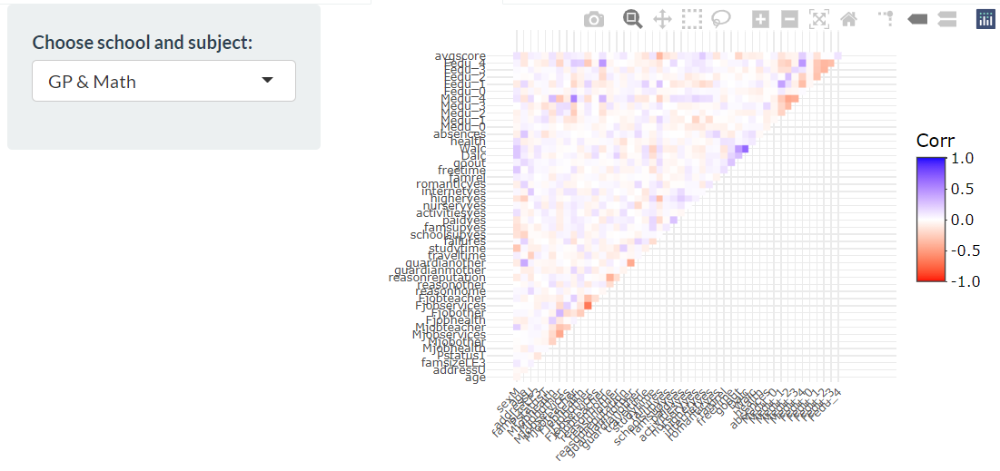
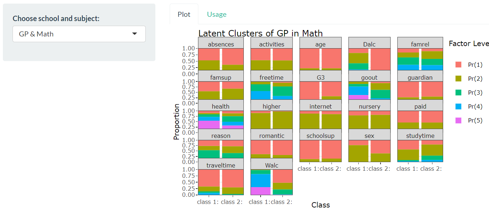
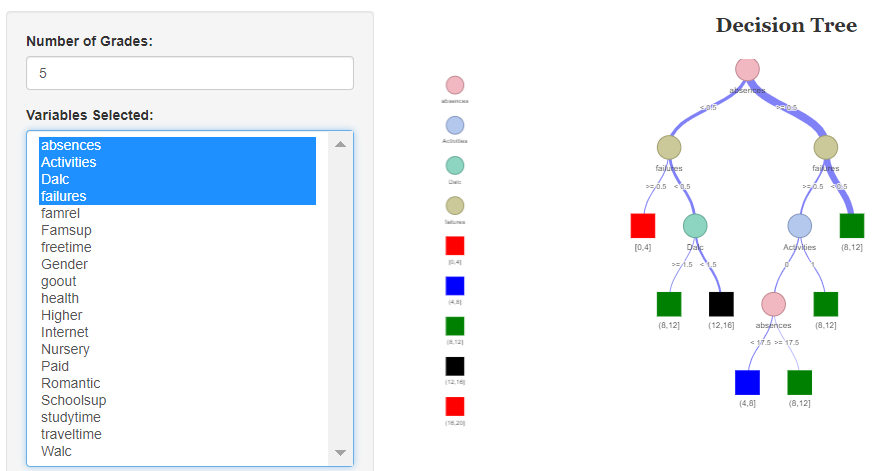
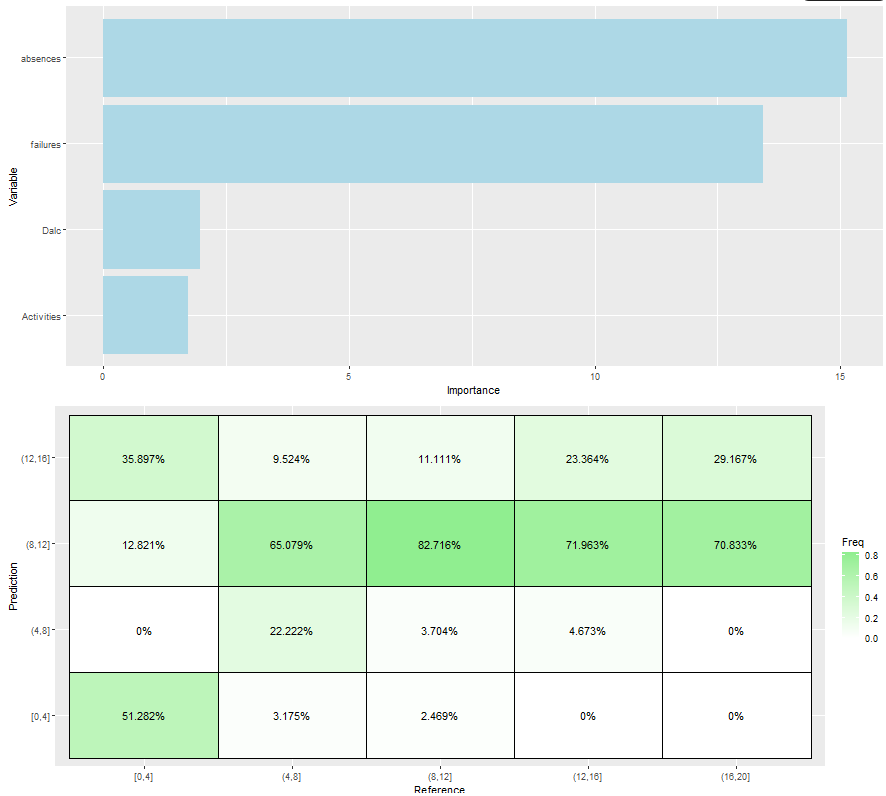
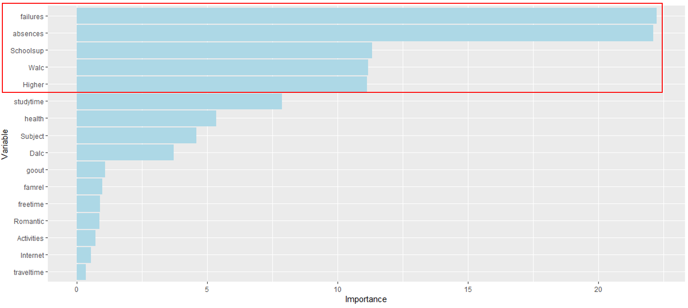

```{r setup, include=FALSE}
knitr::opts_chunk$set(echo = FALSE)
```

# Introduction
Education has a significant impact on a person, be it in terms of employment opportunities and quality of life. It is hence important to know what are factors that affect one’s academic performance. While there are many factors that can impact a person’s academic performance, family background and one’s lifestyle are two of the larger factors. While there are studies on the correlation between lifestyle and grades, data visualization and interactivity are mostly left out from these studies. 

# Objective/Motivation

Our project sets out to firstly provide an interactive data visualization application that provides data visualization and interactivity where users are able to explore the data in a deeper way, rather than to only see the final result. Secondly, utilizing this application, we aim to identify which variables in a data set impacts grades. 

# Approach/Methodology

Using R, we first performed data wrangling to import the raw data into R. Then, categorical data were transformed into multiple dummy binary data, while data type for ordinal data were set as ordinal. We also split the data by school and subject, to remove the variability in grades due to these variables.

Exploratory analysis was performed to explore the data set in terms of proportions within each variable. Then, clustering analysis was done to group students similar in terms of their demographics. Subsequently these clusters were compared against each other within individual variables to study the differences between these groups. Finally, predictive analysis was performed to identify variables that have significant impact to a student's grades.

The three main analysis will be split into tabs at the top of the application. 

# Exploratory Data Analysis
**Bar Chart/Histogram:** The bar chart and histogram chart is used to visualize the distribution and proportions of each variable in the data set, where the user is able to select the data set as well as the variable to explore.
```{r echo=FALSE, message=FALSE, warning=FALSE, out.width='80%', fig.align='center', fig.cap='Bar chart'}

```

**Violin Chart:** The violin chart overlayed with a boxplot provides the user with a chart to compare distribution and the mean grades for each of the inputs in each variable selected. The user is able to select the data set and the variable to explore further. 
```{r echo=FALSE, message=FALSE, warning=FALSE, out.width='80%', fig.align='center', fig.cap='Violin chart'}

```

**Correlation Chart:** The correlation plot gives the user an overview of the correlations between each variable, including the average grade where positive and negative correlation are indicated by blue and red respectively. Here, the user can view the correlation value between two variables by hovering the cursor over the specific cell, and zooming in by dragging a rectangle. 
```{r echo=FALSE, message=FALSE, warning=FALSE, out.width='80%', fig.align='center', fig.cap='Correlation Chart'}

```

# Cluster Analysis

In cluster analysis, latent class clustering was used. The user is able to compare the stacked bar charts based on factor levels for each cluster within each variable box. The user is able to select the data set to review. 
```{r echo=FALSE, message=FALSE, warning=FALSE, out.width='80%', fig.align='center', fig.cap='Correlation Chart'}

```

# Predictive Modeling
**Decision Tree:** The decision tree shows how the algorithm predicts the grades based on decisions made through inputs of the selected variables. In the chart, the squares represent the predicted grade bin, while the circles represent the variables used in the decision making process. Here, the user is able to select the number of bins for grades and the variables for analysis.
```{r echo=FALSE, message=FALSE, warning=FALSE, out.width='90%', fig.align='center', fig.cap='Decision Tree'}

```

**Bar Chart:** The bar chart here ranks the selected variables according to the importance, or the significance it has on the student's grades. 

**Confusion Matrix:** The confusion matrix is vital in allowing the user to see the performance of the prediction. With this, the user is able to compare the accuracy of the prediction with different combinations of variables selected. 
```{r echo=FALSE, message=FALSE, warning=FALSE, out.width='80%', fig.align='center', fig.cap='Bar chart and confusion matrix'}

```

# Findings
We found that the top 5 variables that are important in predicting a student's grades are number of failures, number of absences, extra education support, weekend alcohol consumption as well as the desire for higher education.

```{r echo=FALSE, message=FALSE, warning=FALSE, out.width='80%', fig.align='center', fig.cap='Bar chart and confusion matrix'}

```

However, based on results from the confusion matrix, the results were not ideal especially for the grade bins for for high and low scores. This could be due to the small number of samples that scored low or high results academically. 

# Future Work

- Increasing number of data points will improve the robustness of the prediction model, giving more accurate predictions

- Exploring and comparing more methods of analysis, for example logistic regression for prediction, then comparing the accuracy of both models will be useful

- Having an additional function to allow users to upload their data to use the application for their own exploration of their data set to expand the usage of this application


```{r, include=FALSE}
knitr::write_bib(c('knitr','rmarkdown','posterdown','pagedown'), 'packages.bib')
```

